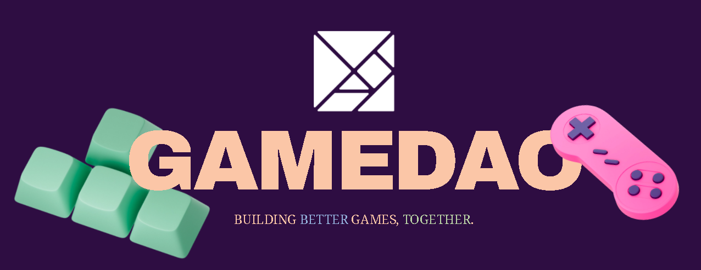
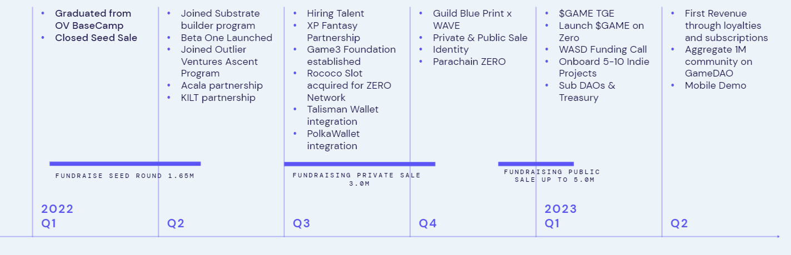

# 🕹 What is GameDAO?


**Keep it real:** The contents of these pages, published under docs.gamedao.co are a collection of the latest developments of our protocols and not considered final. We live an open and transparent culture and therefore publicly share works in progress and knowledge.


### Introduction

GameDAO is a multifaceted coordination platform built on [ZERO Network](https://parachains.info/details/zero) using substrate.io. [ZERO network](https://app.gitbook.com/u/HeKxHypN2kaHbZt2W8VUNnuI3lF2) is a video game multichain network which is part of the Polkadot & Dotsama ecosystem.&#x20;

The GameDAO platform is a place where gamers, creators, investors and esports teams can come together to form collaborative clans (DAOs) to work together to achieve common goals using democratic and transparent technology.&#x20;

Our current aim is the development of a web3-powered fan engagement platform, specifically designed with esports organisations and content creators in mind. This is called the [Battlepass](https://app.gitbook.com/o/gdB0avh011RMXwN2wUzt/s/XlD4fZHAtSiDUCi0qHER/\~/changes/QlIsgHwJXCfCUUnSrdCV/applications/readme).

GameDAO has been set up as an intermediate stock company, GameDAO AG, which is based in Liechtenstein. We recently completed the setup of Game3 Foundation, a charity organisation with aims to support, develop and transform video games into the Web3 era.

In the near future, 100% of GameDAO AG will be contributed to the charity, effectively giving control of the AG to the community over time through progressive decentralisation. Eventually, this means that GameDAO will be wholly governed and controlled by nominated and elected $GAME token holders, instead of a more centralised team.&#x20;

### What's it For?

Whether you want to fund an awesome new game while getting milestone updates, join a lifestyle guild and vote on merchandise changes, or find like-minded esports enthusiasts to compete for cash—GameDAO gives you the tools to create and coordinate.

GameDAO is also the platform where the community can collaboratively own and govern games funded and created on the platform: You can vote on changes, development updates and more—all as a democratic community, using **DAO**s.

The team behind GameDAO is currently made up of tech gaming enthusiasts, with backgrounds in everything from traditional business, to esports, to design and game development.

### **Vision and Mission**

GameDAO’s vision is to become the go-to hub for game enthusiasts to ideate, create and build games and organisations collaboratively and sustainably. We want to both inspire and reward game creators, players, publishers, and investors together on a safe and secure social platform.

Our mission is to reconfigure the gaming industry into a participation and ownership-based industry where all key contributors can participate, collaborate and coordinate. No more developers that don’t listen to the community. No more opaque communication channels and awkward forums. One transparent, low-barrier platform for the community, by the community.

<figure><figcaption></figcaption></figure>

### **Community**

The community is the energy that powers GameDAO. The platform itself will be community-governed, allowing individuals to create clans and organisations to achieve goals together in a decentralised way.&#x20;

Coordinate your goals together as part of a group; share a decentralised treasury, or even enable early market proof of a game you’re building by getting direct feedback from the testers all on one platform.

If you’d like to see some specific use cases in action, visit the Use Cases section for some examples of organisations built using GameDAO.

> GameDAO: the protocol directly connecting gamers, creators, publishers and investors.

### Roadmap

<figure><figcaption>
Currently a WIP, this is our up-to-date roadmap for 2022-2023 Q2
</figcaption></figure>

## Getting Started

**Got 2 minutes?** Check out a video overview of an early prototype:


early prototype



review in the wild

