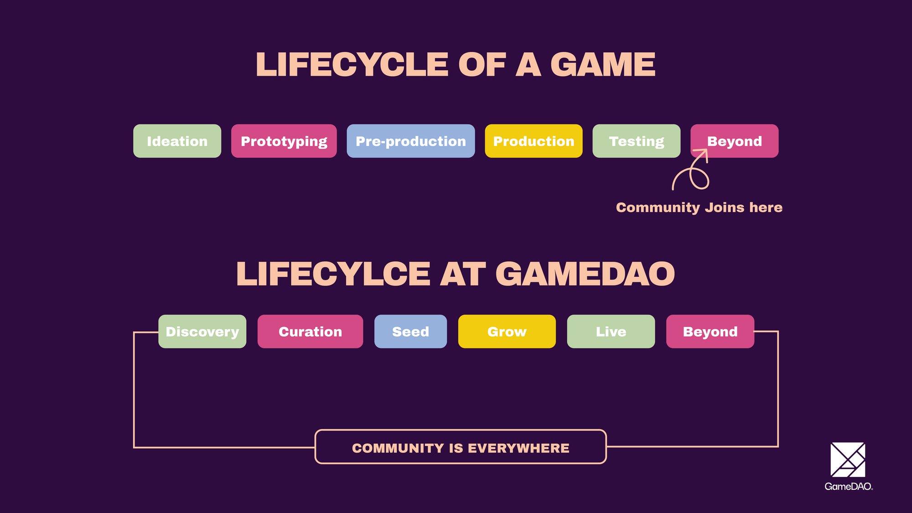

# 🎨 Creators & Devs

## Overview

For creators, GameDAO offers DAO tooling so that everyone from concept artists to sound engineers and backend game developers can create, organise and coordinate their own DAOs to achieve whatever goals they need.

## Game Developers

Game developers, especially indie developers, are faced with a hypercompetitive industry and often lack both marketing and fundraising expertise, making it more difficult to bring their ideas to life. For this reason, more and more game developers are beginning to use crowdfunding and alternative funding models, as well as implementing Free-to-Play models which carry high risks if their game underperforms at market.&#x20;

Game developers on GameDAO can create DAOs to fundraise from the community directly in a transparent way. Directly interacting with the community means there's a lessened need for marketing expertise, and the community of gamers can offer consistent feedback through simple channels, plus being able to do alpha and beta testing.&#x20;

Ultimately, GameDAO integrates the community into game development at every step of a game's lifecycle, with the aim of making game development a more sustainable and open industry for all.

<figure><figcaption>
<strong>[IMAGE TO BE CHANGED]</strong>
</figcaption></figure>

### Creator & Developer Benefits

1. Marketing & Growth support: Bootstrap your community through GameDAO
2. Gain early and direct feedback from users - the people that will play your game or use your assets
3. Early feedback means early market-proof in a seamless way.
4. Credible support and funding using the community as investors
5. Tap into the community for post-launch support, new content, and ongoing development
6. Incentivise the player base through bug bounties and rewards for contributions
7. Offer users and gamers rewards in tradeable digital assets powered by GameDAO
8. Gamers feel more valued and more willing to contribute

\
\
