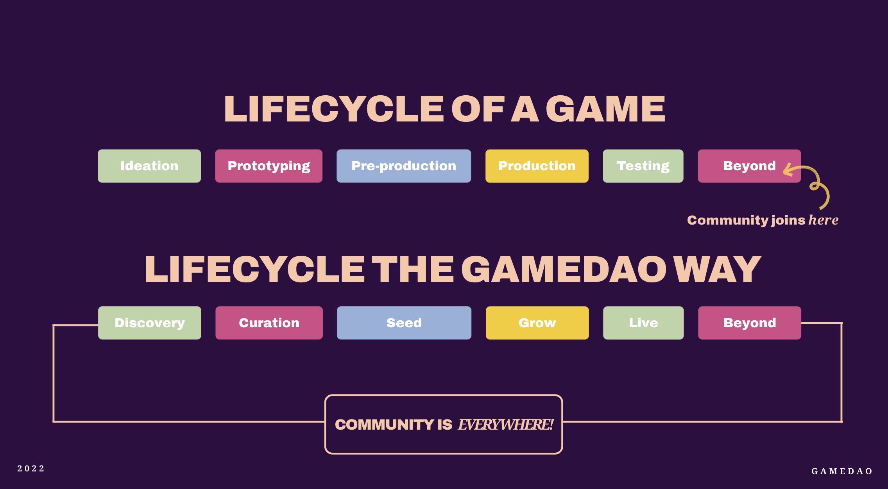

# ⚙ Use Cases

## 1. The Lifecycle of a Game

In the traditional gaming industry, gamers are mostly uninvolved in the processes leading up to a game's release. From ideation to development and funding, gamers have little to no say. Even with traditional fundraising platforms, gamers can contribute funds directly via crowdfunding campaigns.&#x20;

However, these are often opaque, and though they do provide incentives and rewards, gamers are not involved-they still don't have a say in the development process, nor can they contribute to decisions made by the developers. More over, there have been many cases where these traditional platforms have not protected users well from scams and money-grab projects.

<figure><figcaption>
Through GameDAO, communities are integrated into the entire lifecycle of an organisation
</figcaption></figure>

## 2. The GameDAO Way

A **DAO** is a **D**ecentralised **A**utonomous **O**rganisation. It's a democratic group of people facilitated by technology, usually used for coordinating and making decisions together. By using DAO tooling, gamers and creators can be involved in collaborative DAOs alongside one another, building more sustainable businesses together.&#x20;

This means gamers are directly integrated into the development process of a game, or the business model of something like an esports organisation. But more than that, gamers can create their own DAOs for everything from organising in-game clans, to coordinating competitive tournaments all through GameDAO's platform.

As a game enthusiast you could, for example, create a proposal to make changes to a game's development. With enough votes, the motion would pass, and the changes implemented - all through a democratic vote, initiated by the community and executed by the DAO.&#x20;

You could also be incentivised and rewarded for these contributions, or for your achievements on other platforms, getting rewarded in digital assets for being a perfectionist.

Read on to find out more about specific use cases and mechanisms of GameDAO's tools.
