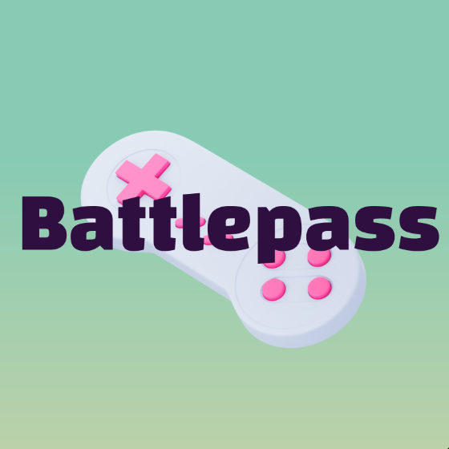

# 👨‍👦 Beeblebrox Testing

In order to interact with the chain without frontend do the following steps to achieve an end2end result:

### Configure Beeblebrox DEV Chain

first you need to open your polkadot.js.org wallet and add the beeblebrox endpoint as a custom node.\

1. click the network selector on the top left
2. scroll down to the bottom
3. click DEVELOPMENT
4. add as custom endpoint `wss://beeblebrox.zero.io/node`
5. click switch on the top to access the new endpoint\
   .png>)\
   \

### Get ZERO, GAME & PLAY token

Get ZERO coin:

1. click Developer --> Sudo
2. under "submit the following change" select `balances`
3. in the right dropdown select `setBalance(who, newFree, newReserved)`
   1. field `who`: keep `Id` selected
   2. field `Id`: select your personal wallet address which should receive ZERO coins
   3. field `newFree`:  enter `1000000000000000000000` to receive 1000 ZERO
   4. field `newReserved`: leave 0 inside
4. click `Submit Sudo`
5. click `Sign and Submit` in the new modal
6. repeat steps 3-5 while selecting another wallet address at 3.3 if you want to top up other accounts (<mark style="color:purple;">**recommended to have at least 3 accounts keeping ZERO tokens for later scenarios**</mark>)

Get GAME token:

1. click Developer --> Sudo
2. under "submit the following change" select `currencies`
3. in the right dropdown select `updateBalance(who, currencyId, amount)`
   1. field `who`: keep `Id` selected
   2. field `Id`: select your personal wallet address which should receive GAME tokens
   3. field `currencyId`: enter `1` for GAME token
   4. field `amount`:  enter `1000000000000000000000` to receive 1000 GAME
4. click `Submit Sudo`
5. click `Sign and Submit` in the new modal
6. repeat steps 3-5 while selecting another wallet address at 3.2 if you want to top up other accounts (<mark style="color:purple;">**recommended to have at least 3 accounts keeping GAME tokens for later scenarios**</mark>)
7. .png>)

Get PLAY (stablecoin) token:

1. click Developer --> Sudo
2. under "submit the following change" select `currencies`
3. in the right dropdown select `updateBalance(who, currencyId, amount)`
   1. field `who`: keep `Id` selected
   2. field `Id`: select your personal wallet address which should receive PLAY tokens
   3. field `currencyId`: enter `2` for PLAY token
   4. field `amount`:  enter `1000000000000000000000` to receive 1000 PLAY
4. click `Submit Sudo`
5. click `Sign and Submit` in the new modal
6. repeat steps 3-5 while selecting another wallet address at 3.2 if you want to top up other accounts (<mark style="color:purple;">**recommended to have at least 3 accounts keeping PLAY tokens for later scenarios**</mark>)
7. 

&#x20;

### Create Organisation

Either go through the frontend process on haiku.gamedao.co or follow this process:

1. click Developer --> Extrinsics
2. .png>)
3. select under `control` pallet "submit the following extrinsic"
4. select `createOrg(...)` in the right dropdown
5. .png>)
6.

### Join Organisation

...

### Create Fundraising campaign

...

### Fund into campaign

...

### Create withdrawal proposal

...

### Vote for withdrawal

...

### check your treasury

...
